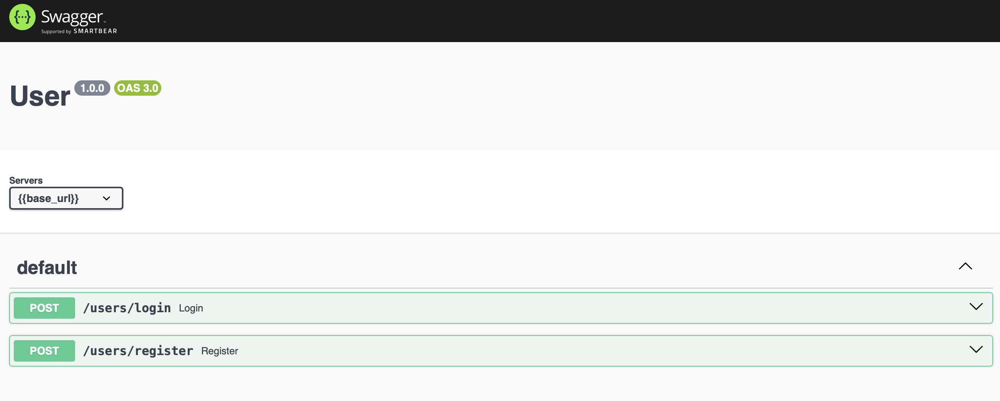

# Postman.json 轉換成Swagger.json、yaml
將Postman產出的json檔案轉成可用swagger-ui-express檢視的檔案，可再轉換成.yaml檔

## 功能
- 轉換成swagger.json檔案

- 使用swagger_UI檢視API

- 將swagger.json檔案轉換成yaml檔

## 使用之前...
請先確認有安裝node.js及npm

## 複製專案
1. Fork
2. git clone

## 初始化
```
npm install // 安裝套件
```

## Postman to swagger

- 上傳postman導出的API文件至專案根目錄

- 修改json_2_openapi.js中的file變數，改為要讀取的filename

- 啟動json_2_openapi，將postman.json轉換為swagger版本的json，會在output中新建資料夾並將產出檔案放入其中
```
npm run openapi
```

## 本地端確認Swagger版本的API

- 開啟app.js，修改讀取檔案路徑

- 啟動app.js，可以檢視swagger版本的api，也可以發送api請求
```
npm run dev
```

範例：在本地讀取自己創立的swagger API


## Swagger to yaml

- 修改openapi_2_yaml中的file變數，改為要讀取的filename

- 修改openapi_2_yaml中的collection變數，改為要讀取的檔案路徑

- 啟動openapi_2_yaml，將swagger版本的json轉換為yaml檔
```
npm run yaml
```
